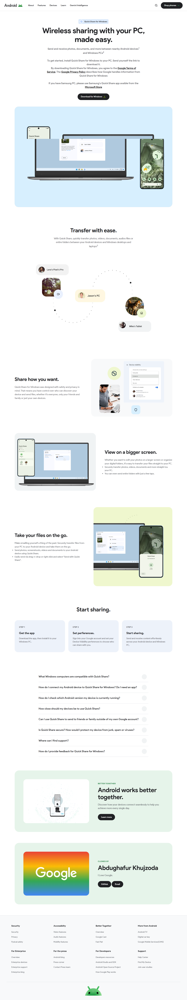

# Android Quick Share (Download for Windows) Clone

A responsive frontend clone of the official **Android Quick Share for Windows** landing page, built using **HTML, CSS, and Vanilla JavaScript**.

> **Disclaimer:** This project was created for educational purposes only. All trademarks, logos, and design assets belong to Google. No copyright infringement is intended.

---

## 📸 Preview

### 🌐 Original Website


Official reference: https://www.android.com/better-together/quick-share-app/

---

### 🧪 Clone



**Live Demo:** Clone this repository and open `index.html` inside the **QuickShare for Windows** directory.

---

## 📅 Project Information

- **Created:** June 20, 2026
- **Author:** **Abdughafur Khujzoda**
- **Purpose:** Practice frontend development by recreating a real-world landing page with pixel-accurate design.

---

## ⚙️ Tech Stack

- HTML5
- CSS3 (Flexbox & Grid)
- Vanilla JavaScript
- SVG Graphics
- MP4 Video Assets

---

## ✨ Features

- 📱 Responsive landing page
- 🎥 Auto-playing hero section videos
- ❓ FAQ accordion built with `<details>` and `<summary>`
- 🎨 Pixel-level UI recreation
- 📐 Clean and organized layout structure
- ⚡ Lightweight with no external frameworks

---

## 🧠 What I Learned

During this project, I improved my understanding of:

- Building complex landing page layouts
- Creating responsive designs with Flexbox and Grid
- Handling browser video autoplay behavior
- Organizing large HTML/CSS projects
- Working with SVG graphics and embedded media
- Improving spacing, alignment, and UI consistency

---

## 🚀 Run Locally

```bash
git clone https://github.com/Abdughafur/WebClones.git

cd "WebClones/QuickShare for Windows"

# Open index.html in your browser
```

---

## 📄 License

This project is intended for **educational and portfolio purposes only**.

The original design belongs to Google. This repository is not affiliated with or endorsed by Google.
